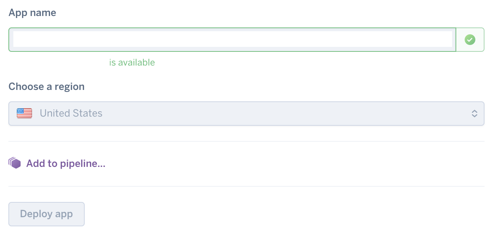
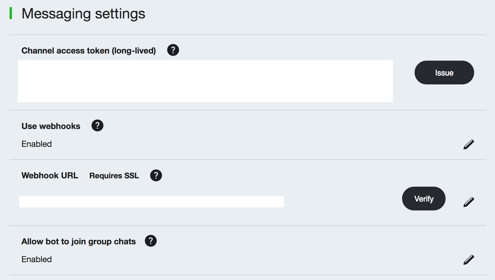
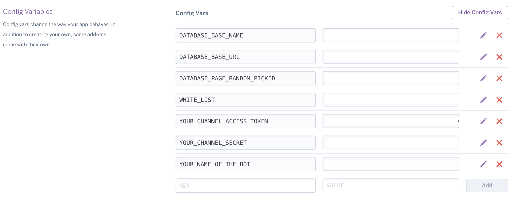

# Project 2 : Funny Chat Group Bot Template
This is a README documant for [English Version](README.md), 也有[中文版](README_Chinese.md)的說明文件        
We want to share an easy deployment chatbot script to help others to build a chatbot with their customized content in a short time.        
Hopefully, you do not need to write a script but to configure some hidden key by adding config var in Heroku console.         

## Installation and Usage
1. [**Heroku**] Press the button to create a Heroku App, and you will need to log in or register a new Heroku account.
    - 
2. [**Heroku**] Fill the information inquired by Heroku to create the App.
	- 
3. [**Heroku**] Take a note for the URL of your Heroku App. It will be something like https://YOUR_HEROKU_APP_NAME.herokuapp.com
4. [**LINE**] Log in to your LINE developer account or register one if you do not have.
    - <https://developers.line.me/en>
5. [**LINE**] Go to your LINE developer account, and add a new Messaging API service.
6. [**LINE**] Fill your Heroku App URL to URL column, disable "Auto-reply messages" and enable "Use webhooks". Addtionally, to enable "Allow bot to join group chats" if you want your bot able to join a chat group.
7. [**LINE**] Take a note for the "Channel secret" and "Channel access token". 
	- 
	- 
	- 
8. [**Heroku**] Go back to Heroku portal, and goto "Setting" and select "Config Variables" by pressing button "Reveal Config Vars".
9. [**Heroku**] Add variables for following things,
	- Add "YOUR_CHANNEL_ACCESS_TOKEN" and fill "Channel access token" which you got from LINE Messaging API service portal.
	- Add "YOUR_CHANNEL_SECRET" and fill "Channel secret" which you got from LINE Messaging API service portal.  
10. **Now, you can add the chatbot as your LINE friend and start to do some test with limited function. To provide more interest things, you might need a database, please follow below steps to set up a Firebase database. We choose Firebase since we think it is easy to manage.**
11. [**Firebase**][**Optional**] Visit following link and log in or register a new account.
    - <https://firebase.google.com>
12. [**Firebase**][**Optional**] Press "Console" next to your account photo.
13. [**Firebase**][**Optional**] Launch a new project according to instruction of the webpage.
14. [**Firebase**][**Optional**] Click the project and enter project console, and then select "Database". You will see the URL of your database such as https://YOUR_DATA_BASE_NAME.firebaseio.com
15. [**Heroku**][**Optional**] Follow Step 9 to add 
	- "DATABASE_BASE_URL" => https://YOUR_DATA_BASE_NAME.firebaseio.com
	- "DATABASE_BASE_NAME" => any word you like
	- 

## Database columns

## Hidden Keys
- **DATABASE_BASE_URL**
- **YOUR_NAME_OF_THE_BOT**
- **WHITE_LIST**